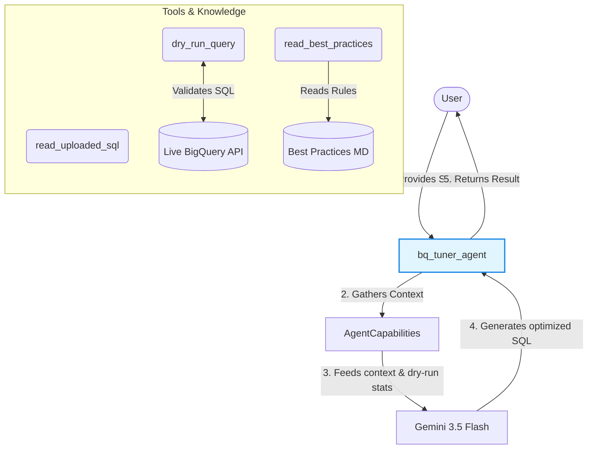
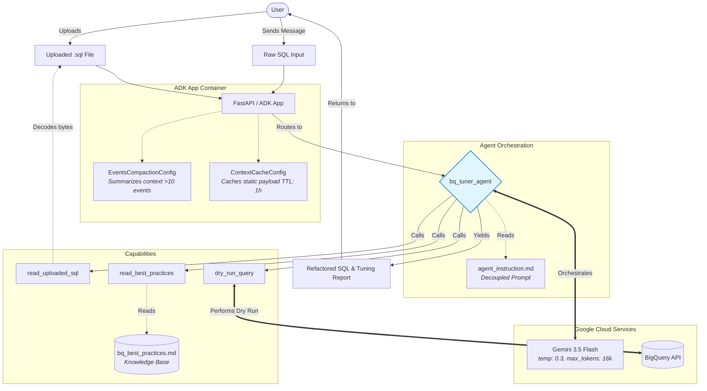

# BQ Optim Agent: Architecture & Design Document

This document outlines the architectural decisions, design patterns, and thought process behind the `bq-optim-agent` application, built utilizing the Google Agent Development Kit (ADK).

## 1. Core Objective
The `bq-optim-agent` is designed to be an expert-level BigQuery SQL tuning assistant. Its primary function is to analyze user-provided SQL scripts, compare them against official Google Cloud architecture frameworks, perform dry runs via the BigQuery API, and propose refactored queries optimized for reduced slot usage and minimized byte scanning.

## 2. Core Architecture Diagram

This simplified diagram focuses on the core interaction loop: how the Agent uses its tools to gather context and validate data before relying on the LLM to generate the final output.

## 3. Architectural Design Patterns

### Decoupled Configuration & Environment Isolation
To maintain security and operational flexibility, the agent completely abstracts configuration details away from the application logic. 
*   **No Hardcoding:** The target LLM (`GEMINI_MODEL`), Google Cloud Project, and deployment locations are injected strictly via `.env` files using `load_dotenv()`. 
*   **Prompt Decoupling:** System instructions are isolated into a standalone Markdown file (`agent_instruction.md`). This allows prompt engineers to tweak the agent's persona without navigating or modifying Python execution logic.

### Dynamic Knowledge Injection (RAG-lite)
Instead of stuffing the system prompt with every possible BigQuery optimization rule, the agent relies on an externalized, dynamic knowledge base.
*   **Tool-Driven Knowledge Retrieval:** The agent uses a custom `read_best_practices` tool to read a living `bq_best_practices.md` document at runtime. This document contains advanced compute optimization strategies directly scraped from official GCP documentation (e.g., pruning partition queries, broadcast join optimization, CTE materialization warnings, and nested field denormalization).

## 4. ADK Best Practices Implemented

The application aggressively follows the structural rules mandated by the ADK ecosystem:

### Strict Tool Contract Enforcement
All tools (`read_best_practices`, `read_uploaded_sql`, `dry_run_query`) have been structurally bound to ADK typing standards. They explicitly return JSON-serializable dictionaries (`dict`) containing `status` flags and `content` payloads rather than raw strings, ensuring seamless parsing by the agent orchestration engine and avoiding serialization errors.

### Context Compaction & Memory Management
Because the agent ingests potentially massive `.sql` files and lengthy best-practice documents, the context window is prone to rapid overflow during multi-turn conversations.
*   **`EventsCompactionConfig`**: Attached to the global `App` instance, this configuration monitors the session history. Every 10 events, it triggers a background process to summarize older interactions (while keeping a 2-event overlap for continuity), guaranteeing the context window never exceeds LLM limits while retaining critical reasoning history.

### Context Caching for Cost Reduction
The combination of the system prompt and the `bq_best_practices.md` document constitutes a massive, highly static text block sent on every invocation.
*   **`ContextCacheConfig`**: Implemented with a `min_tokens=2048` threshold and a 1-hour TTL. By caching this static payload natively on Google's infrastructure, the agent drastically reduces input token billing costs and achieves significantly lower latency on subsequent turns within a session.

### Agent Description for Multi-Agent Scaling
The `bq_tuner_agent` is initialized with a strict `description` attribute. While seemingly trivial for a standalone agent, this is a mandatory ADK pattern that ensures the agent can be instantly discovered and orchestrated by parent coordinator agents, or securely published as an endpoint via the A2A (Agent-to-Agent) protocol.

## 5. Model Selection Strategy

The agent utilizes the **Gemini 3.5 Flash** model (`gemini-3.5-flash`), configured via the multi-region `us` endpoint to guarantee high availability and bypass regional quota constraints (e.g., `us-central1` limitations). 

**Generation Configuration (`generate_content_config`):**
*   `temperature=0.3`: A low-creativity setting tailored for deterministic code generation. It prevents hallucinations and ensures structured, reliable SQL rewrites.
*   `max_output_tokens=16384`: Configured to balance providing enough headroom to rewrite and explain extensive scripts (up to ~1,000 lines of SQL) while preventing excessively massive, unreadable outputs.
*   `top_p=0.95` and `top_k=40`: Standard decoding settings optimized for logic-heavy technical tasks.

## 6. Execution Flow

1.  **Ingestion:** The user provides a SQL query via text or file upload. 
2.  **Context Building:** The agent triggers `read_uploaded_sql` (if needed) and `read_best_practices` to build its tuning criteria.
3.  **Analysis & Validation:** The agent analyzes the SQL against the knowledge base and invokes `dry_run_query` against the live BigQuery API to evaluate predicted scan bytes.
4.  **Refactoring:** Leveraging low-temperature generation, the agent outputs a refactored query alongside an itemized explanation of bytes saved and architectural anti-patterns resolved.

## 7. Detailed Architecture Flow

This detailed diagram visualizes the complete data flow, context management, and external tool integrations within the application.

